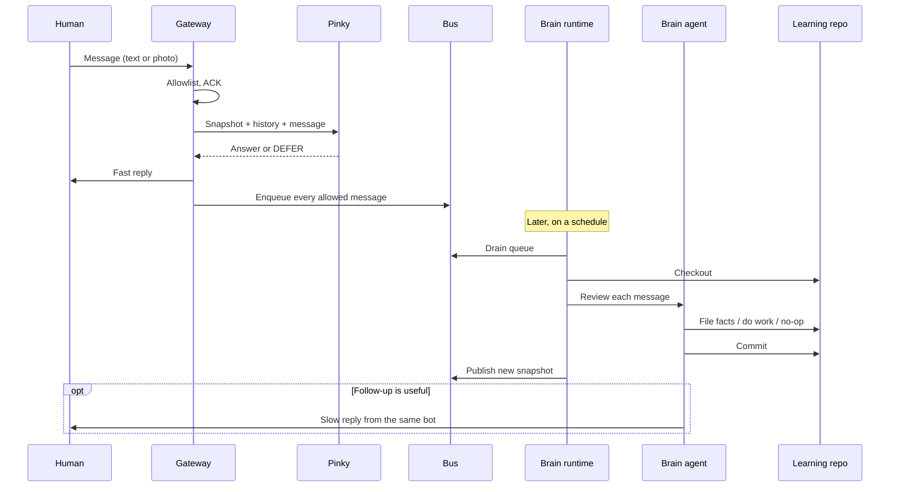

# Pinky and The Brain

A two-agent architecture for a personal assistant that can chat *now* and learn *later*.

You talk to one bot. Two minds answer.

- **Pinky** is fast and present. It chats from a published snapshot of what it already knows. It cannot write durable memory.
- **Brain** is slower and reclusive. It wakes on a schedule, reads everything that arrived, updates the knowledge base, and republishes a snapshot for Pinky.

The distinctive store is not a vector database. It is a **git repo that is both the knowledge base and the control plane**. Brain writes Markdown. Pinky reads a curated snapshot of that Markdown. Nothing is durable until it is committed.

This repo is a framework: contracts, piece list, and starter skeletons. Swap the chat platform, the fast model, the agentic CLI, and the compute. Keep the write barrier.

> The name is an allusion to the 1990s cartoon, used here as architecture shorthand. Not affiliated with Warner Bros.

## Why two agents

A single always-on agent that can edit your life-repo, call tools, and reply in under a second is expensive, fragile, and hard to keep honest. Split the jobs:

| | Pinky | Brain |
|---|---|---|
| Latency | Seconds | Minutes to hours |
| Tools | Chat + optional vision | Full agentic CLI in a repo checkout |
| Memory | Published snapshot + short chat history | The git repo |
| Writes | Queue only | Knowledge pages, ledgers, code |
| Honesty rule | Answer from context or **defer** | File, build, or decide it was a no-op |

The load-bearing rule is not “use two models.” It is the **write barrier**: Pinky never writes the repo. Brain is the only durable writer.

## The pieces

Your first cut is close. A few names need splitting, and two pieces were hiding inside the implementation.

```
Human
  └─ Chat platform          Telegram, Slack, Discord, SMS, …
       └─ Bot identity      The one thing they DM
            └─ Gateway      Auth, ACK, enqueue, send reply
                 ├─ Pinky   Fast LLM + snapshot + history
                 └─ Bus     Queue + history + published snapshot
                      └─ Brain runtime     Scheduled compute
                           └─ Brain agent  Cursor CLI, Claude Code, …
                                └─ Learning repo
```

| Piece | Role | Reference impl | Swap with |
|---|---|---|---|
| **Learning repo** | Knowledge + functions + durable memory | Markdown + scripts in git | Any git host |
| **Chat platform** | Where humans talk | Telegram | Slack, Discord, iMessage, SMS |
| **Bot identity** | The one surface they address | A BotFather bot | Workspace app, phone number |
| **Gateway** | Edge: allowlist, ACK, enqueue, reply | Serverless HTTP function | Cloudflare, Fly, a VPS |
| **Pinky** | Fast LLM; no durable writes | A cheap multimodal chat model | Any chat/vision model |
| **Bus** | Queue + history + snapshot | Redis | SQS + KV, Postgres, files |
| **Brain agent** | Agentic CLI that edits the repo | Cursor CLI | Claude Code, Codex, Aider |
| **Brain runtime** | Scheduled compute that wakes Brain | GitHub Actions | A box, other CI, a cron VM |
| **Brain workspace** | Checkout + tools + secrets Brain can touch | `ubuntu-latest` + the repo | Laptop, cloud VM |

**Gateway, not router.** “Router” overclaims. The fast path does not dispatch Brain in realtime. It answers or defers, and it **always** enqueues. Routing is a function inside the gateway, not a piece.

**Bot identity, not “chatbot.”** The human does not talk to a chatbot *and* Pinky. They talk to one bot. Pinky is the fast mind behind it. Brain may follow up later from the same bot.

**Brain environment is two pieces.** The runtime is where the job runs. The workspace is what the agent can see and touch. Same agent, different rooms.

**The bus is first-class.** Without a queue, a history store, and a published snapshot, Pinky and Brain cannot share state asynchronously.

Read [docs/architecture.md](docs/architecture.md) for the full model, [docs/pieces.md](docs/pieces.md) for each piece, and [docs/write-barrier.md](docs/write-barrier.md) for the rule that makes the rest work.

## The loop



## Contracts you should not skip

These are the interfaces. Implementations can change; the promises should not.

1. **Write barrier.** Pinky cannot create, edit, or delete knowledge. It may only enqueue.
2. **Always enqueue.** Every allowed inbound message is queued for Brain, including the ones Pinky already answered.
3. **Answer or defer.** Pinky answers only from the published snapshot and recent history. If the fact is not there, it says so in a fixed **DEFER** phrase. It does not invent.
4. **Queued, not saved.** When the human says “remember this,” Pinky acknowledges that Brain will file it. It never claims the repo was already updated.
5. **Snapshot, not git.** Pinky does not clone the repo. Brain publishes a curated subset (`fast_context: true` pages, or your equivalent). New facts reach Pinky on the next publish, not the next deploy.
6. **One fact, one page.** Durable knowledge is Markdown with a date and a source. Inbox and staging are not knowledge.
7. **Fail closed.** Unknown senders are dropped. Empty allowlist means nobody.
8. **No double reply.** If Pinky already covered the turn, Brain prints a suppress token instead of texting again.
9. **Pinky sees pixels; Brain files text.** If you accept photos, only Pinky looks at the image. Brain files from the description. Image bytes do not go in git.
10. **Brain may have more senses.** Email, calendar, and docs can feed Brain without ever touching Pinky.

Schemas and message shapes: [docs/contracts.md](docs/contracts.md).

## What this is not

- Not a hosted assistant.
- Not a drop-in clone of any one production system.
- Not a requirement to use Telegram, Gemini, Vercel, Cursor, or GitHub Actions. Those are one reference stack ([docs/reference-stack.md](docs/reference-stack.md)).
- Not a vector-RAG starter. You *can* add embeddings later. The canonical store is still the repo.

## Start here

```
starter/
  AGENTS.md                 Tier 0. Who you are, who the agent is.
  knowledge/                Tier 1–2 pages Pinky may eventually see
  schemas/                  Inbox and snapshot JSON Schema
  gateway/                  Edge handler sketch
  brain/                    Scheduled review workflow + prompt
```

Copy `starter/` into a **private** repo. A learning repo that holds a life should not be public.

Then:

1. Fill `AGENTS.md` and one knowledge page about yourself.
2. Stand up a gateway in front of your chat platform.
3. Point Pinky at a published snapshot, not the whole git history.
4. Schedule Brain in whatever compute you already trust.
5. Keep the write barrier when you add features. If Pinky starts writing the repo, you no longer have this architecture.

## Docs

| Doc | What |
|---|---|
| [Architecture](docs/architecture.md) | The model, the loop, and what was wrong with the first piece list |
| [Pieces](docs/pieces.md) | Each piece, what it owns, what it must not own |
| [Write barrier](docs/write-barrier.md) | The rule that makes two agents worth running |
| [Knowledge base](docs/knowledge-base.md) | Git as memory; tiers; citations; intake vs knowledge |
| [Contracts](docs/contracts.md) | Message, defer, snapshot, intake, suppress |
| [Adapters](docs/adapters.md) | How to swap channel, model, agent, and runtime |
| [Reference stack](docs/reference-stack.md) | One combination that has been run in production |
| [Lessons](docs/lessons.md) | Hard-won operating notes, kept generic |

## License

MIT. See [LICENSE](LICENSE).
